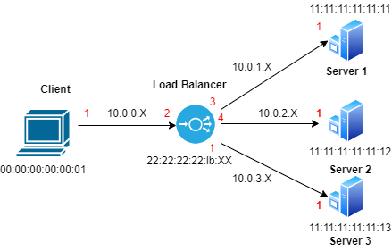

# GLB - Load Balancer
The project consists in creating a practical fully functioning environment in P4. In this case, the system designed is a Load Balancer which must parse the packets received and forward them into several backends. The system's topology is as follows:

Therefore, a client will be the one sending traffic to the backends. The switch must receive the packets, parse the information and forward them to the servers. To do so, a protocol layer has been created, called GLB, which has a 16-bit field called **ncon**. This field contains a value that determines which server the packet should be forwarded to.

## Getting Started 
* Since Hangar tends to minimality---and to using a console rather than a GUI---the `xterm` command in Mininet does not work. Instead of `mininet> xterm h1 h2` do the following:

        1. `mininet> client create_screen 'client'` # Note that the single quotes are essential, otherwise Mininet will expand "client". 

        2. `mininet> s1 create_screen 's1'` 

        3. `mininet> s2 create_screen 's2'` 

        4. `mininet> s3 create_screen 's3'` 

        5. `$ attach_screen client` # This will present you with a shell running on client. Note that this command is run from the command shell in Hangar, which you can get by opening another ssh session or using a screen multiplexor.

        4. `$ attach_screen s1` # This command, run from a fresh command shell, will present a shell on s1.
           `$ attach_screen s2` # This command, run from a fresh command shell, will present a shell on s2.
           `s$ attach_screen s3` # This command, run from a fresh command shell, will present a shell on s3.

* `receive.py` and `send.py` scripts have been created to send packets to the backends that will be forwarded to s1, s2 and s3 according to the `ncon` value of the packet.
        - Run `./receive.py`in s1, s2 and s3 to get the servers listening to their eth1.
        - Run `./send.py`in client to send packets from the client to the load balancer.
        - The packets will be sent to the Load Balancer, and the LB will be able to change IP addresses and ports to forward the traffic.